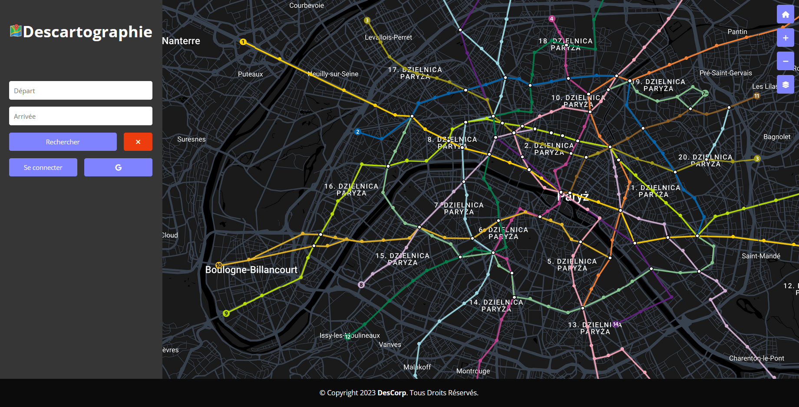

## DESCRIPTIF
- Ceci est un projet informatique réalisé dans le cadre de la ressource R3.01 - Développement Web. L'objet du projet est une application web full stack. Notre sujet a été le réseau du métro parisien qui permet de visualiser, calculer et enregistrer des trajets.
- Le site est hébergé sur https://descartographie.ait37.fr

## FONCTIONNALITÉS
### CARTE
- Visualiser le réseau du métro parisien sur une carte de type Google Maps.
### DIJKSTRA (PCC)
- Calculer un trajet d'une station de métro A à une station de métro B, à l'aide de l'algorithme de [Dijkstra](https://fr.wikipedia.org/wiki/Algorithme_de_Dijkstra). L'entrée des stations peut se faire de deux façons :
    - En cliquant directement sur les marqueurs présents sur la carte.
    - En entrant les stations dans les champs de saisie avec une liste déroulante qui permet de s'assurer de l'existence de la station.
- Le trajet et le temps estimé sont accompagnés d'une animation sur la carte interactive. (Cette partie se trouve dans `index.js` avec la fonction `animatePathSegment`)
### COMPTE
- L'application intègre un système de gestion de comptes utilisateurs.
- L'utilisateur a deux manières de se connecter :
    - Identification classique à l'aide d'une adresse mail et d'un mot de passe.
    - Identification [OAuth 2.0](https://developers.google.com/identity/protocols/oauth2) de Google afin de permettre une authentification simple sans mot de passe. (Cette partie se trouve dans le fichier `api.php`)
    - Toutes ces données sont stockées sur une base de données *(1ère table : User)*.
- Après authentification, l'utilisateur pourra utiliser l'application pour enregistrer des trajets avec des noms associés. Un espace utilisateur y est dédié.
- Enregistrer un trajet :
    - Il lui faudra tout d'abord sélectionner le trajet, puis l'enregistrer en cliquant sur "Enregistrer le trajet" une fois le chemin généré, une pop-up s'ouvre donc pour indiquer le nom à donner au trajet. (*2ème table : Saves*)
- Suppression d'un trajet :
    - L'utilisateur n'a qu'à faire un clic droit sur l'itinéraire dans la section "Vos trajets enregistrés".
### STACK TECHNIQUE
- Front-end : HTML, CSS, Vanilla JS
- Back-end : Vanilla JS, PHP
### DONNÉES UTILISÉES
- Les données ont été récupérées au format JSON à partir de https://data.iledefrance-mobilites.fr/explore/dataset/emplacement-des-gares-idf avec quelques ressources en plus pour avoir une approximation du temps entre stations.
- En gardant l'essentiel, nous avons abouti à 2 fichiers JSON placés sur un serveur web distant :
    - `stations.json` - dans ce fichier sont stockées toutes les stations du métro parisien avec leur géolocalisation (longitude, latitude), ligne de métro et d'autres informations importantes. Le fichier `json` "clean" est disponible sur https://descartographie.ait37.fr/assets/json/stations.json
    - `interconnection.json` - dans ce fichier sont stockées toutes les liaisons entre stations (cela inclut aussi les correspondances entre la même station de lignes différentes) avec la durée associée. Le fichier `json` "clean" est disponible sur https://descartographie.ait37.fr/assets/json/interconnection.json
### RESPONSIVE
- Le site a été conçu pour s'adapter à tous types d'écrans (PC, PC portable, tablettes, téléphones).